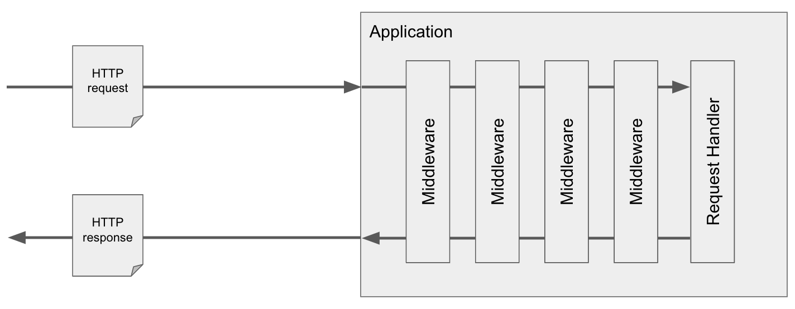

2018 has been a great year for PHP.

PHP 7.3 has been released, with yet some more performance improvements. That also marked the end of life of PHP 5.x
branch as well as PHP 7.0, which will, hopefully, push forward the [migration to PHP 7.1](https://gophp71.org) with
its nullable types. Speaking of types, the [typed properties RFC](https://wiki.php.net/rfc/typed_properties_v2) has
very narrowly missed the feature freeze for PHP 7.3 and we will have to wait another year for it.

There were some notable achievements in the community activities as well. [PHPStan](https://github.com/phpstan/phpstan)
has gained quite some momentum and, along with it, so did static analysis and emphasis on code quality. The Framework
Interoperability Group has approved several PSRs (PHP Standards Recommendations), among which the PSR-15 stands out
which I am going to discuss further below. Partly in response to the new wave of PSRs,
[Symfony has left the organization](https://github.com/php-fig/fig-standards/pull/1120), which is indeed bad news,
but that's a different story - definitely worth reading though.

What I am going to talk about here is a set of related PSRs and the aforementioned PSR-15 in particular because they
might significantly change how we write some kinds of web applications. But, to make the difference as clear as
possible, let's get to it the long way around, starting by how we write most kinds of web applications today.

Whatever your framework of choice, there is usually a routing component which stands as a gateway between the HTTP
and the application layer. It analyzes the incoming HTTP request, transforms it to an appropriate application request
and passes it to a controller.

The controller then does everything else.


## The bloated controller

The biggest problem with controllers, in my experience, is that they tend to grow, both horizontally, and vertically.
The horizontal dimension manifests itself in the number of actions in the controller. Let's imagine we're writing
a RESTful API for a blog: if we create a `PostController` with actions that map to the CRUD operations, we have a
bloated controller that violates the single responsibility principle. It's a subtle violation, because all of those
actions are kind of related to each other, but it is a violation nonetheless, because the controller has more than
one reason for change. Luckily, this one is quite simple to fix: just split the one big class into several,
single-action controllers.

The vertical growth is sneakier and occurs when you stack responsibilities onto the controller that do not even feel
connected to one another. We probably want the create, update and delete operations to be accessible only to
authenticated users, so we add an `if` to check that. Then another business request comes in: posts can only be
updated by their authors or moderators. So we add some sort of authorization. Then we find out that more sections
of the API require authentication, so we extract the authentication logic to an abstract `AuthenticatedController`
to reuse it.

And these are all business requirements, but it can also be purely technical: if someone decides that the API will
be served from a sub-domain, we need to add CORS headers so that the client application can access it. This logic,
again, has to be put somewhere and might even have to be made configurable with a whitelist of allowed origins.
A couple of weeks later, we end up with shiny single-action controllers which still have many responsibilities,
bitterly hidden in a long chain of inheritance.


## Middlewares to the rescue

Middlewares are one of the most elegant solutions to this problem and have been used in this context extensively
in Node.js frameworks for a long time. They are extremely simple: a middleware is basically a function that has
access to the HTTP request and response and to the next middleware in the middleware stack. The following picture
shows a lifecycle of the whole application, which should make all this more clear:



The application is like an onion and the middleware stack forms its layers. The incoming HTTP request is passed
through the middlewares, one by one, eventually reaching the final request handler which produces an HTTP response.
The response then makes its way back through the middlewares, in the inverted order, before being sent to the client.
Each middleware can execute any code both prior to and after calling the next middleware. They can make changes
to the request and response objects. They may choose not to call the next middleware at all, terminating the
request-response cycle early.

They can encapsulate a single responsibility in a small, composable bit of code. You might have one middleware
that deals with CORS, one for authentication, prepended by a middleware that reads and writes session and session
cookies. There might be another one for authorization, and a last one with the routing logic. Neither of those
middlewares knows about the others, they are all self-contained. And yet, you can build a whole working application
out of them, using only composition instead of inheritance.


## The `callable` problem

Perhaps my first contact with an HTTP middleware in PHP was in the [Slim Framework](https://www.slimframework.com/).
This is how they look in its version 3.0:

```php
use Psr\Http\Message\ResponseInterface;
use Psr\Http\Message\ServerRequestInterface;

$requestHandler = function (
	ServerRequestInterface $request,
	ResponseInterface $response
): ResponseInterface {
	return $response;
}

$middleware = function (
	ServerRequestInterface $request,
	ResponseInterface $response,
	callable $next
): ResponseInterface {
	return $next($request, $response);
}
```

Both request handlers and middlewares have access to the HTTP request and response. In addition, middlewares receive
a reference to the `$next` middleware in stack. (Note that it is actually wrapped in a request handler so that
middlewares themselves don't have to worry about what comes next – that is the responsibility of an outer layer,
discussed later in this post.)

One thing you might have noticed is that Slim uses HTTP message interfaces as standardized in PSR-7. This has been
around for some time now and while it received some criticism (among others from Symfony), it has become a widespread
standard.

Another thing you might have noticed is that Slim uses functions. The `$next` reference is simply a `callable`, which
is rather vague. PHP, unfortunately, has no mechanism to formalize and, more importantly, type-check the signature
of a callback function, which leaves a lot of space for errors and is also far less convenient for the developer
because they have to memorize the function's signature or look it up in the docs.

And that's where, finally, PSR-15 comes in. People have worried about this problem, proposed some solutions and about
a year ago, the PSR-15: HTTP Server Request Handlers has been approved. It basically just formalizes request handlers
and middlewares using PHP interfaces:

```php
use Psr\Http\Message\ResponseFactoryInterface;
use Psr\Http\Message\ResponseInterface;
use Psr\Http\Message\ServerRequestInterface;
use Psr\Http\Server\MiddlewareInterface;
use Psr\Http\Server\RequestHandlerInterface;

$requestHandler = new class implements RequestHandlerInterface {

	/** @var ResponseFactoryInterface */
	private $responseFactory;

	public function handle(
		ServerRequestInterface $request
	): ResponseInterface
	{
		return $this->responseFactory->createResponse();
	}

};

$middleware = new class implements MiddlewareInterface {

	public function process(
		ServerRequestInterface $request,
		RequestHandlerInterface $next
	): ResponseInterface
	{
		return $next->handle($request);
	}

};
```

Request handlers are almost the same. The only difference is that they don't receive a pre-made `$response` to modify
and have to create a new response instead. The response has to be any implementation of the PSR-7 interface, and
perhaps the best option if you aim for a reusable request handler is to delegate its creation to a response factory
as defined by PSR-17, which was approved later last year.

Middlewares follow on the same note, with one huge difference: the `$next` reference is not a `callable`, but a properly
type-hinted instance of a request handler which the middleware might or might not choose to delegate to.


## A frameworkless application at last

Now that we have middlewares standardized thanks to PSR-15, it is easy to reuse what others have made. There's a
[growing list of various open-source middlewares](https://github.com/middlewares/awesome-psr15-middlewares) and
searching the Packagist for "middleware" should produce a plethora of PSR-15-compatible solutions. And even if
you can't find anything that would solve your particular problem, writing a middleware from scratch is easy too.

There's still something missing though: request handlers and middlewares alone do not just cut it. There must
be an (aforementioned) outer layer, a dispatcher that glues the whole middleware and request handler stack together
into a single entrypoint. However difficult it sounds, it's a short piece of code. Two reference implementations
of different approaches are even provided in the
[PSR-15 meta document](https://www.php-fig.org/psr/psr-15/meta/#63-example-interface-interactions) and if you want
a ready-made solution, there are plenty of them as well. One of the more popular ones is
[`mindplay/middleman`](https://packagist.org/packages/mindplay/middleman):

```php
$middlewareStack = [ /* an array of middlewares */ ];
$dispatcher = new Dispatcher($middlewareStack);

$response = $dispatcher->dispatch($request);
```

There is another benefit to this approach: you can use this code in different server schemes. It might be used in
the traditional request-response lifecycle in which you create a `ServerRequestInterface` instance from the global
environment, run it through the middleware stack, and finally send the response through
[one](https://github.com/narrowspark/http-emitter)
[of](https://github.com/http-interop/response-sender)
[many](https://docs.zendframework.com/zend-httphandlerrunner/) PSR-7 response emitters.

But if you are adventurous, you can wire the same code into an asynchronous HTTP server like the ones made possibly
by [Swoole](https://www.swoole.co.uk/), [Amp](https://amphp.org/) or [React PHP](https://reactphp.org/).

That's interoperability at its finest.


## Closing thoughts

In the end, the whole application is truly unique, and yet composed of common little, reusable bits. This is not to say
that it has no strong foundation - it does. You can even have a PSR-11-compatible DI container underneath so that you
can have, among other handy techniques, lazy-loaded request handlers.

Neither does it mean that you should throw away big frameworks. Lots of them are split into separate packages, so
nothing prevents you from employing Nette's powerful DI container, Symfony's super-fast routing component, elegant
templating engine such as Latte, and Doctrine ORM, all in one application.

So, as with any other current buzzword that ends with "less", you have to take it with a pinch of salt: a framework
is there, in a sense, only the application builds its own rather than using stock Symfony, Nette, Laravel, etc.

Middlewares are also no silver bullet. In my experience, this approach is ideal for simpler applications where using
a big framework could bring in more complications than benefits. The type of application is important too: it's really
great for RESTful APIs which, pretty much by definition, work closely with the HTTP layer, but for building an
HTML-heavy end-user application with lots of templates, cross-links, AJAX and alike, a full-featured framework would
probably be a wiser choice.

But the middleware approach is definitely worth some attention. Give it a try on your next small-ish project, learn
its pros and cons, find out where it plays good and where it doesn't fit, and add it to your programming repertoire.
And feel free to share your thoughts in the comments below.
