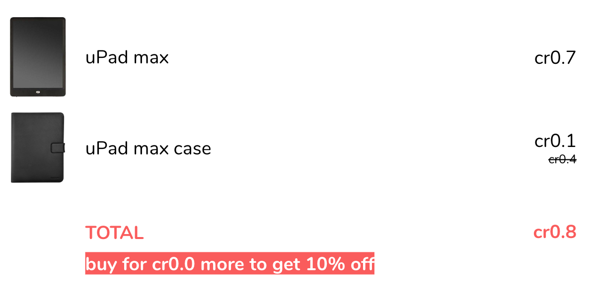

## Let's `float`

I'll jump straight into the demonstration, to get you all motivated. Imagine the following situation: I am
binge-reading Twitter, and suddenly, among the flood of cute kitten videos, here comes a special offer: a fictitious
uShop gives 10% off if you spend at least 0.8 credits. (Credits are, obviously, a pretty strong currency.)

This of course draws my attention. I click through to uShop and after a short while stumble upon the ideal product:
the most recent uPad max with a smart case for a special price. And it all perfectly sums up to 0.8 which should
grant me a 10% discount.


I don't hesitate for long. Until I find out that there is no discount. To add to my confusion, uShop tells me to
spend another 0.0 credits. Huh? What's wrong?



You might have guessed it already: uShop is using floats.


## The floating box of crap

Imagine a different situation: I am a uShop developer and receive a ticket about the obscure behaviour. I find it
challenging and dive right into it, and soon become equally confused as the customer: What is the problem? I mean,
if you put `0.7 + 0.1` to PHP console, it gives you the expected answer:

```php
var_dump(0.7 + 0.1);
> float(0.8)
```

...or, does it, really?

```php
var_dump(0.7 + 0.1 === 0.8);
> bool(false)
```

That's pretty weird. But okay, PHP is clearly flawed and I start persuading the management that we need to rewrite
uShop in Node.js. I've wanted to try that for some time anyway. And JavaScript is so hip, they must do elementary-school
maths right, right?

```js
console.log(0.7 + 0.1);
> 0.7999999999999999
```

Um. Okay. At least JavaScript doesn't bullshit me like PHP did. But what the hell is going on?


## What is a `float`?

The thing is you'd still end up with the same result if you rewrote uShop in pretty much any programming language since
the very beginning of programming languages. The problem lies deeper, beyond languages, in how computers store data,
particularly numbers. Let's start with a little theory of how numbers are represented in general.

[Wikipedia says](https://en.wikipedia.org/wiki/Floating-point_arithmetic) that floating-point arithmetic uses
"formulaic representation of real numbers as an approximation," and goes on to explain the formula:

> A number is, in general, represented approximately to a fixed number of significant digits (the significand) and
> scaled using an exponent in some fixed base. A number that can be represented exactly is of the following form:
>
> 1.2345 = 12345 x 10^-4


### What is a `float` to a computer?

With the high school recap done, let's see how those numbers are represented in computers. That is dictated by
IEEE 754, a standard established in 1985 and followed by almost all computing technology ever since then.

IEEE 754 defines many different formats. The one most relevant to us is the double precision format, which is
used by countless languages and virtual machines including PHP and JavaScript.

Double precision is a binary format - meaning that the base is 2 - that occupies 64 bits: with one for the signum
and eleven for the exponent, 52 bits are left for the significand. One of its bits is encoded implicitly, so that's
effectively 53 bits of information. What does it mean?


### Storing a number in double precision format

Perhaps the most important part is that double precision is a binary format. Since we've already revised our
elementary and high school math skills, the only thing left is to remember those boring computer science classes
at the university, and convert a decimal number `0.7` to binary.

Decimals are converted in two steps: first the integral part, then the fractional part. The integral part is zero,
so that's easy. The fraction not so much: we'll have to multiply it by two, subtract the integral part of the result,
and keep doing this until we reach zero:

- 0.7 x 2 = 1.4 --> we'll subtract 1 and keep it;
- 0.4 x 2 = 0.8 --> 0
- 0.8 x 2 = 1.6 --> 1
- 0.6 x 2 = 1.2 --> 1
- 0.2 x 2 = 0.4 --> 0
- 0.4 x 2 = 0.8 --> 0
- 0.8 x 2 = wait a minute, we're back at step three!

It turns out that decimal 0.7 converts to binary 0.10(1100) recurring. In other words, the number doesn't have a finite
binary expansion. Incidentally, the same applies to 0.1 which is converted to binary 0.0(0011) recurring. With the
53 bits the double precision format gives us, the representation has to be cut off at some point:

- 0.7 --> 0.699999999999999955591079014994
- 0.1 --> 0.100000000000000005551115123126

Those two long numbers are the closest values that a computer is capable of keeping in memory. They add up to a number
that is slightly lesser than 0.8 - the difference doesn't manifest itself until the sixteenth decimal place, but it's
there nonetheless.


## Let's do arbitrary precision math

Now we know what's wrong - and that it is not, in fact, wrong. But even though it's technically a feature, not a bug,
it's a rather impractical one. Oh yes, there are use cases in which we want to gain performance at the cost of losing
a tiny bit of precision (in games, for example). But there are many more where things are at stake, ranging from tax
inspection fines when miscalculating money, to credibility in case of scientific research, to the lives of US soldiers
[in the Gulf War](http://www-users.math.umn.edu/~arnold//disasters/patriot.html).

Unfortunately, PHP doesn't have a native API like, for instance, Java's `BigDecimal`, but there are two extensions
that can be used for arbitrary precision math: GMP and BC Math. The latter is generally more usable (as in
developer-friendly) while the former is presumably faster. But why even bother with choosing the best low-level
solution when there are nice abstractions.

My favourite one is [`brick/math`](https://github.com/brick/math). Internally, it works with GMP or BC Math,
whichever is available, or if none is available, it provides its own PHP implementation which basically uses the
same algorithm as if you did the math on paper. Publicly, it exposes an API not unlike that of Java, which is a
well-thought one:

```php
BigInteger::of('7');
BigDecimal::of('0.7');
BigRational::of('7/10');
```

It provides three classes for three different use cases: one for integers of any length, one for numbers with
finite decimal expansion, and one for all rational numbers. The last one is particularly interesting: it keeps
track of the numerator and denominator separately, so that it can *exactly* represent numbers such as two thirds.

Now if you want to add up two numbers, it's easy and quite intuitive:

```php
$uPad = BigDecimal::of('0.7');
$case = BigDecimal::of('0.1');
$total = $uPad->plus($case);
```

You might note that in this API, all three classes ensure immutability - if you add the price of the case to that
of the uPad, it returns a new instance with the result, but `$uPad` keeps its value of `0.7`.

And if you compare the result, I finally get the 10% off my new uPad!

```php
if ($total->isGreaterThanOrEqualTo('0.8')) {
	$total = $total->multipliedBy('0.9');
}
```


## I've got 99 problems, and a dollar ain't 0.9999974645547

Martin Fowler, in his bible Patterns of Enterprise Application Architecture,
[says this about Money](https://martinfowler.com/eaaCatalog/money.html):

> A large proportion of the computers in this world manipulate money, so it's always puzzled me that money isn't
> actually a first class data type in any mainstream programming language. The lack of a type causes problems, the
> most obvious surrounding currencies. If all your calculations are done in a single currency, this isn't a huge
> problem, but once you involve multiple currencies you want to avoid adding your dollars to your yen without taking
> the currency differences into account. The more subtle problem is with rounding. Monetary calculations are often
> rounded to the smallest currency unit. When you do this it's easy to lose pennies (or your local equivalent) because
> of rounding errors.

We now have a way to overcome one problem Fowler mentioned: rounding errors. So what about the other one? If you work
in a multi-currency setup, you certainly don't want to mix up a strong currency such as credits with a weak one such
as US dollars. Imagine sending somebody $699, an equivalent of 0.7 credits for the uPad, and them receiving 699 credits
instead. It's certainly nice for the recipient, but not for the bank, and the least for the developer responsible for this.

That's why there is another package in the Brick family: [`brick/money`](https://github.com/brick/money). As you might
have guessed, it builds on top of `brick/math` and pretty much mirrors its API, adding support for currencies:

```php
$credits = new Currency('XCR', 0, 'Credits', 5); // credits are precise to 5 decimal places
$uPad = Money::of('0.7', $credits);
$case = Money::of('0.1', $credits);

$total = $uPad->plus($case);
```

Now if you try to apply a $100 voucher, you'll get a `MoneyMismatchException`:

```php
$voucherValue = Money::of('100', 'USD');
$totalWithVoucher = $total->minus($voucherValue); // throws
```

Another great feature is the ability to use money in specific contexts, the most useful example being cash rounding.
For example, in the Czech Republic we round cash to nearest whole crown, while Ireland and Switzerland round to
nearest 5 cent. This can be represented using `CashContext` and again, an exception is thrown if you try to mix
such value up with an incompatible one:

```php
$cash = Money::of('99', 'CZK', new CashContext(100));
$discount = Money::of('9.99', 'CZK');
$cash->minus($discount); // throws
```


## Databases are no exception

Another topic we need to discuss is storing numbers in the database. The obvious choice would be `FLOAT`, wouldn't
it? Well, the float in the database is represented in IEEE 754, so it suffers from the same issues as floats in the
application codebase. In PDO, it even maps to a PHP `float`.

A much better choice is the `NUMERIC` type (also known as `DECIMAL`). It maps to a PHP string, so it's safe for
pretty much any value, and it works with a fixed-point precision. That is both its pro and its con: in some databases,
you need to define the precision and scale of the `NUMERIC` column when creating it, and while not a single world's
standard currency uses a scale larger than four, you can easily get to 18 with some cryptos (ethers, namely).

Also, the SQL standard is one thing and its implementations are another. For example in PostgreSQL, `NUMERIC` without
given precision nor scale can store a value of any precision - which is perfect. However, the standard in this case
rather impractically implies that the scale is zero and such column can only store integers. Also, the maximum
precision of a `NUMERIC` column differs across database systems. So please be aware of the features and limitations
of the particular one you're using.

An alternative approach might be to use a `BIGINT` column to store the amount in minor units. While it certainly works,
one thing to consider is that you cannot immediately tell the scale of the value which might complicate calculations,
and again, with some cryptocurrencies (ethers again), you can run into the limits of integer values, even on 64-bit
platforms.

That's the overview of how to store numbers. Monetary values, specifically, also need to keep track of the currency.
I suggest a `CHAR(3)` column with the currency code, because it is unique and human-readable at the same time. You
can also create a composite type if your database supports it:

```sql
CREATE TYPE price AS (
    amount    NUMERIC,
    currency  CHAR(3)
);
```

Some databases also have a native `MONEY` type. One example is the SQL Server, another one is PostgreSQL.
I only know about Postgres's `MONEY` type and I strongly recommend not to use it, because everything about
it - from the fractional precision to the output format - is determined by the database locale settings, so you
might have a hard time working with it from the application.


## `float` no more

I believe I've covered everything about working with fractional numbers and monetary values in PHP and databases.
If not, feel free to ask further questions, add suggestions and share stories in the comments section below.

I'll leave you with a one last tip: Roave has created a [PHPStan](https://medium.com/@ondrejmirtes/phpstan-2939cd0ad0e3)
plugin that detects and forbids `float`s in your codebase. That might be a good starting point of refactoring away
from `float`s. You can find it and learn more in its [Github repo](https://github.com/Roave/no-floaters).
